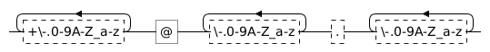

# re2go Slow Issue - Solved

This repository contains code sample for my issue in [re2c#487][issue] where code generated by re2go is magnitude slower than Go's standard `regexp` library. It's already solved but I keep this repository as an archive.

## Problem

I'm using the following regex pattern to find emails in web pages:

```
[\+\-\.0-9A-Z_a-z]+@[\-\.0-9A-Z_a-z]+[\.][\-\.0-9A-Z_a-z]+
```

For Go's standard library, the regex is generated simply by running `regexp.MustCompile`:

```go
var rxEmail = regexp.MustCompile(`[\+\-\.0-9A-Z_a-z]+@[\-\.0-9A-Z_a-z]+[\.][\-\.0-9A-Z_a-z]+`)
```

For re2go, the code is generated by two `.re` templates, one uses custom check for handling end input, and the other one uses sentinel with bound checks. The templates then compiled by re2go using following command (see `Makefile` for more detail):

```
re2go -F --input-encoding utf8 --utf8 --no-generation-date -i $INPUT -o $OUTPUT
```

The problem is there are web pages where code generated by re2go is magnitude slower. In the worst case, Go only takes 20 ms while re2go takes 9 seconds. Several sample of that web pages is included in [`sample`](./sample/) directory.

## Cause

My initial re2go template looks like this (omitted for readability):

```go
func re2EmailSentinel(bytes []byte) int {
	for { /*!re2c
		email = [\+\-\.0-9A-Z_a-z]+@[\-\.0-9A-Z_a-z]+[\.][\-\.0-9A-Z_a-z]+;

		{email} { count += 1; continue }
		*       { continue }
		$       { return count }
		*/
	}
}
```

Let's say I have a string like this:

```
Contact me in john@doe.com
```

The template above will process that string like this:

```
0	Email me in john@doe.com	Store marker in 0.
	^
1	Email me in john@doe.com
	 ^
2	Email me in john@doe.com
	  ^
3	Email me in john@doe.com
	   ^
4	Email me in john@doe.com
	    ^
5	Email me in john@doe.com	We hit space, so it's not email. Go back.
	     ^
1	Email me in john@doe.com	Store marker in 1.
         ^
2	Email me in john@doe.com
	  ^
3	Email me in john@doe.com
	   ^
4	Email me in john@doe.com
	    ^
5	Email me in john@doe.com	We hit space, so it's not email. Go back.
	     ^
2	Email me in john@doe.com	Store marker in 2.
	  ^
```

As you can see, re2go will start from the beginning and spends a long time to recognize those strings as emails. However, in the middle of the string it fails wasting much effort. And then it skips one character (just one!) and starts all over again from the next character.

## Solution

If we visualized the email regex, it's actually composed of 3 quantifier groups:



So, we can split our email regex into three:

```go
func re2EmailSolution(bytes []byte) int {
	for { /*!re2c
		quant1 = [+\-.0-9A-Z_a-z]+;
		quant2 = [+\-.0-9A-Z_a-z]+@[\-.0-9A-Z_a-z]+;
		email  = [+\-.0-9A-Z_a-z]+@[\-.0-9A-Z_a-z]+[.][\-.0-9A-Z_a-z]+;

		{email}  { count += 1; continue }
		{quant1} { continue }
		{quant2} { continue }
		*        { continue }
		$        { return count }
		*/
	}
}
```

Let's use our previous string. The template above will process the string like this:

```
0	Email me in john@doe.com
	^
1	Email me in john@doe.com
	 ^
2	Email me in john@doe.com
	  ^
3	Email me in john@doe.com
	   ^
4	Email me in john@doe.com
	    ^
5	Email me in john@doe.com	We hit space so it's not email but only quant1. Continue.
	     ^
6	Email me in john@doe.com
	      ^
7	Email me in john@doe.com
	       ^
8	Email me in john@doe.com
	        ^
9	Email me in john@doe.com
	         ^
...
```

As you can see, now the generated code is only going forward so it's way faster.

## Final Output

Here is the final output of performance comparison between Go's std regex, my initial re2go template, and my final re2go template that solve this issue. You can run it on your own by running `go run *.go`:

```
File "sample/01.html"
  Go std regex   : 20 ms
  re2go custom   : 9,792 ms (483x slower)
  re2go sentinel : 8,454 ms (417x slower)
  re2go solution : 0 ms (20x faster)

File "sample/02.html"
  Go std regex   : 19 ms
  re2go custom   : 8,266 ms (426x slower)
  re2go sentinel : 6,646 ms (342x slower)
  re2go solution : 1 ms (11x faster)

File "sample/03.html"
  Go std regex   : 25 ms
  re2go custom   : 1,943 ms (77x slower)
  re2go sentinel : 1,514 ms (60x slower)
  re2go solution : 1 ms (24x faster)

File "sample/04.html"
  Go std regex   : 17 ms
  re2go custom   : 1,121 ms (64x slower)
  re2go sentinel : 736 ms (42x slower)
  re2go solution : 0 ms (18x faster)
```

[issue]: https://github.com/skvadrik/re2c/issues/487
